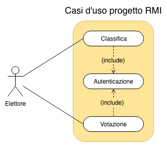
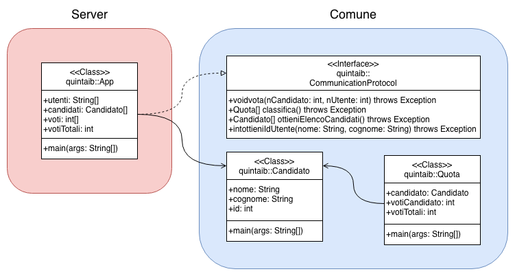

# Programma per elezioni

Risassunto del progetto

Bisogna creare un programma per gestire delle elezioni. Sarà necessaria una parte client con interfaccia grafica e un programma server che ha in memoria i dati e con il quale il client si interfaccia.

# Analisi:

## Server
Il server offrirà i servizi necessari all'utente (vedi in dettaglio i metodi forniti sotto):
1. somministrare un voto (metodo vota)
2. ottenere la lista dei candidati (metodo ottieniElencoCandidati)
3. ottenere la classifica (metodo classifica)
4. autenticarsi (metodo ottieniIdUtente)

## Client
L'interfaccia grafica del client chiederà di specificare nome e cognome per identificare l'utente e successivamente mostrerà la lista dei candidati. L'utente potrà poi selezionare un candidato e somministrare il voto, non sarà possibile annullarlo ne modificarlo (per ora ogni utente potrà somministrare più voti). Se l'utente ha già votato verrà mostrato un messaggio di errore. Si potrà inoltre visualizzare il vincitore tramite un bottone.

# Metodi da implementare:

## void vota(int nCandidato, int nUtente) throws Exception
Questo metodo permette al client di votare un candidato. I dati da fornire sono il numero del candidato (ho preferito mettere un numero per semplificare il sistema di conteggio, questo potrebbe essere utile per implementare un databsse sql dove i candidati hanno un id univoco) e un numero che identifica l'utente che sta votando (stesso discorso). Può esserci un'eccezione se il candidato o l'utente non esistono e se l'utente ha già votato.

## Quota[] classifica() throws Exception
Questo metodo permette di ottenere la classificsa di tutti i candidati. L'oggetto restituito dalla funizone è un array della classe Quota (vedi sotto).

## Candidato[] ottieniElencoCandidati()
Permette di ottenere tutti i candidati che è possibile votare. I dati restituiti sono un array di oggetti Candidato (vedi sotto).

## int ottieniIdUtente(String nome, String cognome)
Permette di ottenere l'id utente da utilizzare nel metodo vota. Se l'utente non viene riconosciuto si ritorna -1. Non è previsto un sistema di accesso tramite password, **sarà un miglioramento futuro**.

# Classi Quota e Candidato:

La classe Candidato contiene i dati di un singolo candidato, per ora sono nome, cognome e id (è molto semplice in questo modo aggiungerne nuovi attributi).

La classe Quota invece contiene il candidato interessato, il numero dei suoi voti e il numero di voti totali.

# Possibili miglioramenti futuri

1. Funzione di backup su file per la lista di utenti, dei candidati e dello stato delle votazioni.
2. L'utente ha la possibilità di visulizzare il voto che ha già somministrato nel caso lo abbia già fatto.
3. Sistema di autenticazio e con password.
4. Visualizzare lo stato delle votazioni con il numero di voti per ciascun candidato.

# Diagramma casi d'uso

# Gerarchia delle classi

