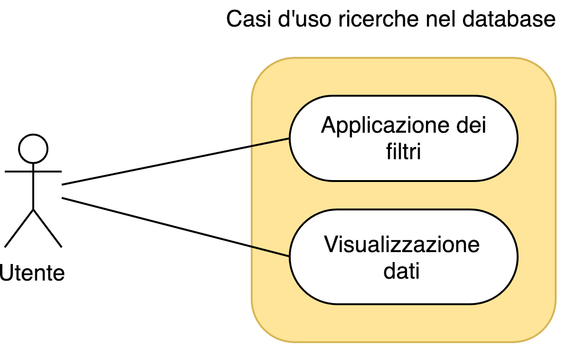
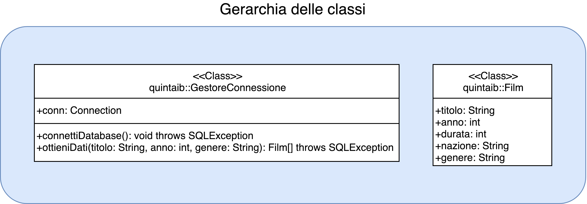

Consegna

Si chiede di realizzare un'applicazione Java che interroghi il DB Videoteca permettendo di selezionare dati indicando più criteri. I criteri da gestire riguardano il titolo, l'anno ed il genere della pellicola. E' richiesta la consegna dei casi d'uso e del diagramma delle classi.

# Analisi:

## Foreground

L'iterfaccia utente avrà il compito di interfacciare l'utente con il database. Sarà necessario visualizzare inizialmente il contenuto della tabella (non filtrata) e fornire la possibilità di appicare dei criteri di ricerca.

I criteri di cui l'utente ha bisogno sono:
1. Titolo
2. Anno
3. Genere

La tabella che verrà mostrata all'utente conterrà tutti i campi della tabella `film` aggiungendo ad ogniuno di essi il proprio genere dalla tabella `genere`.

### Interfaccia

*screenshot dell'interfaccia*

## Background

L'applicazione si collegherà a un server sql per recuperare i dati. Accederà al database `videoteca` e alle tabelle `film` e `genere`.

Per recuperare la tabella iniziale (senza alcun filtro) si effettuerà una semplice query che unirà le due tabelle: `SELECT Titolo, Anno, Durata, Nazione, Nome FROM film JOIN genere ON film.IdGenere = genere.IdGenere;`

Verranno poi aggiunti degli elementi alla query per filtrarne il contenuto in base alla volontà dell'utente nel seguente ordine:
1. Per filtrare il genere: ` AND Nome LIKE "%<genere>%"`
2. Per filtrare l'anno: ` WHERE Anno = <anno>`
3. Per filtrare il titolo: ` AND Titolo LIKE "%<titolo>%"`

# Diagramma casi d'uso

# Gerarchia delle classi

# Possibili miglioramenti

- Sistemare i commenti e intellisense nel codice
- Aggiungere popup di errore per avvisare l'utente (ad esempio per problemi di connessione)
- Avere la possibilità di modificare l'indirizzo del server
