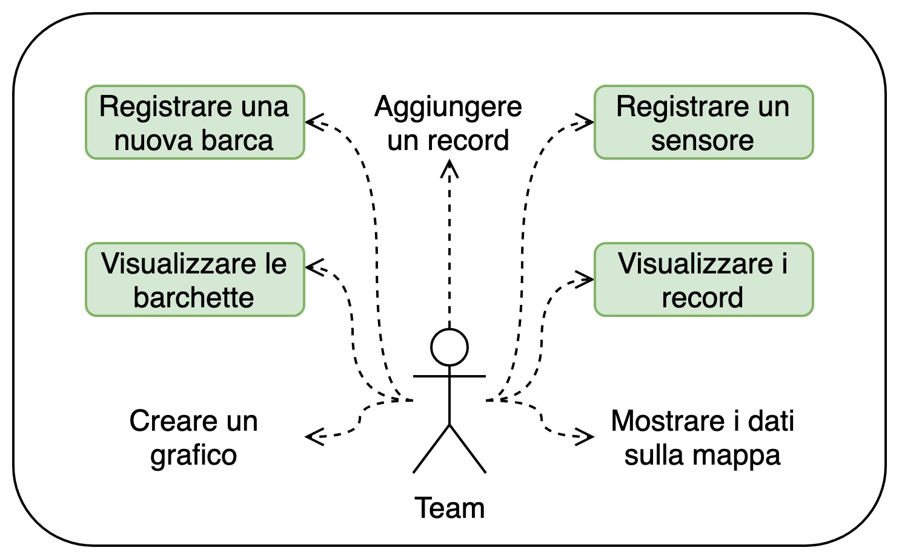
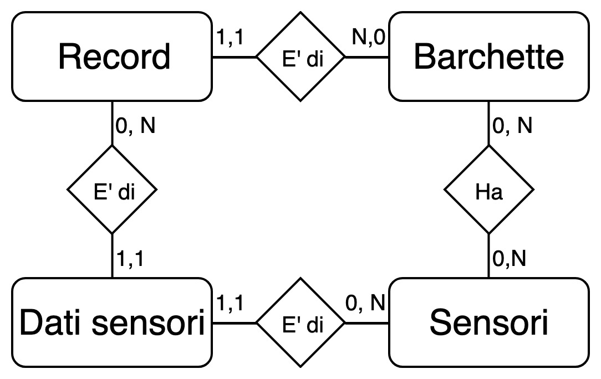
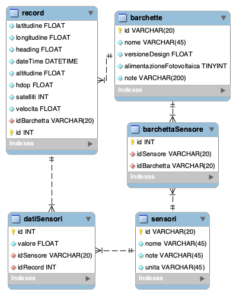

# Database barchette
Alberto Nidasio - Stefano Vassallo

[PDF presentazione 😄](Presentazione_database_barchette.pdf)

## Problema da risolvere
Il team Specchi d’Acqua, che parteciperà alle prossime olimpiadi di robotica a Genova, ha bisogno di salvare i dati ambientali raccolti dalle proprie barchette (temperatura, umidità, ecc...).

## Casi d'uso

## Struttura della soluzione
- Database
- Server REST
- Sito web

## Schema database

